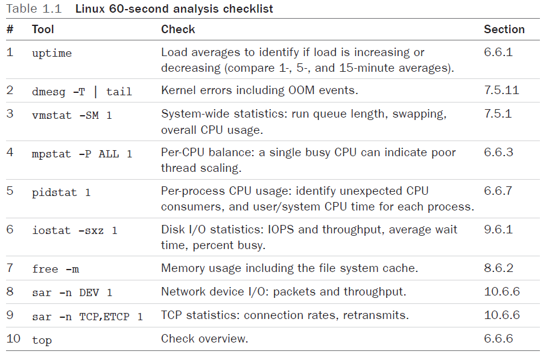

Author: Brendan Gregg

Tools mentioned in the book:
- vmstat: show memory/cpu
- execnoop: prints new processes created
- iperf: on an idle server to perform a TCP network throughput micro-benchmark with a remote idle server
`iperf -c 100.65.33.90 -i 1 -t 10`
- Unix tool

- offcputime: Summarize off-CPU time by kernel stack trace